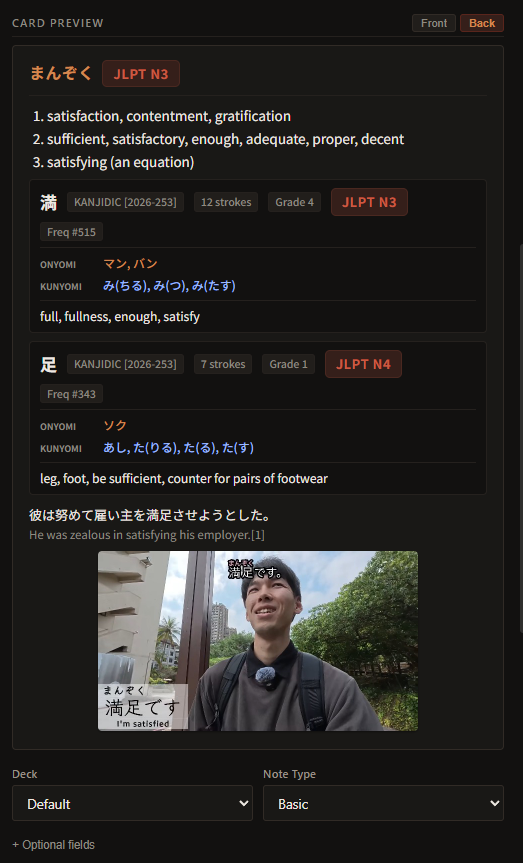
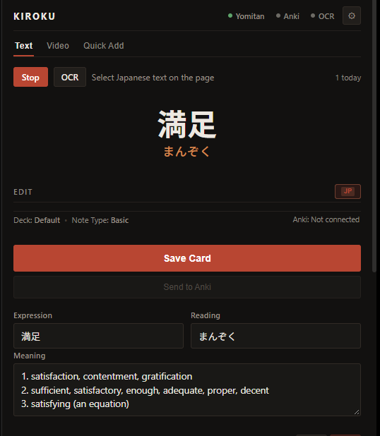
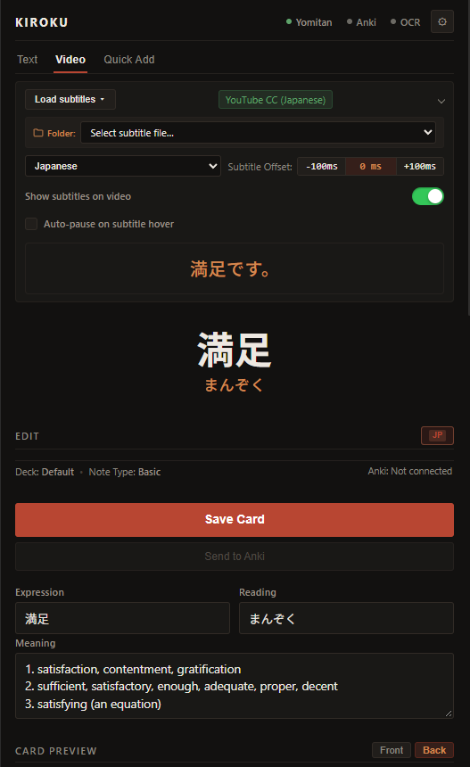
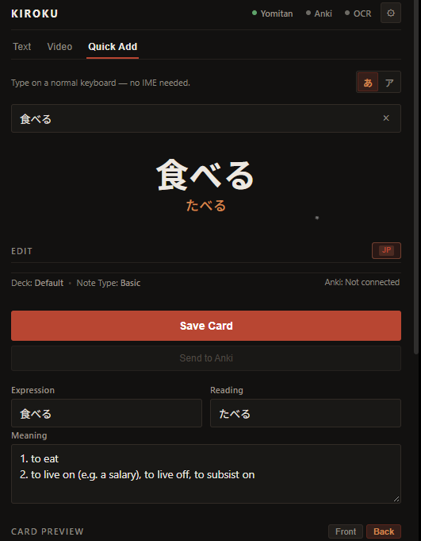

# Kiroku Note 

> **A fast, local-first Japanese vocabulary & sentence mining companion.**  
> See a word → capture context & audio/screenshot → enrich with Yomitan → edit in side panel → save locally in SQLite → sync cleanly to Anki in under 10 seconds.

---

## ⚡ Quick Start & Installation Guide

Even if you have never used Python, a terminal, or built an extension before, you can set up Kiroku Note in just a few minutes!

```
┌─────────────────┐       ┌──────────────────────┐       ┌─────────────────┐
│   Web Browser   │ ────> │  Kiroku Note Tray    │ ────> │      Anki       │
│ (MV3 SidePanel) │ :21828│ (Local SQLite + API) │ :8765 │  (AnkiConnect)  │
└─────────────────┘       └──────────────────────┘       └─────────────────┘
         │                           │
         v                           v
  Yomitan (:19633)          Optional OCR (:21829)
```

---

### Step 1: Download & Install Kiroku Note (Windows)

1. Go to the [Kiroku Note Releases Page](https://github.com/Rhythm-Kachhwaha/kiroku-note/releases).
2. Download the latest installer: **`Kiroku-Note-Setup-v1.0.1.exe`**.
3. Double-click the installer file to run it.
   > **Note on Windows SmartScreen:** Because this is a free, open-source application and not signed with an enterprise certificate, Windows may show a blue popup saying *"Windows protected your PC"*. Simply click **"More info"** and then click **"Run anyway"**.
4. Follow the setup wizard and click **Finish**. Kiroku Note is now installed in your system!

---

### Step 2: Launch Kiroku Note

1. Open your Windows **Start Menu** and search for **Kiroku Note**.
2. Click to run it.
3. You will see a warm orange Japanese **あ** icon appear in your **Windows System Tray** (bottom-right corner near the clock).
4. **Right-click the tray icon** to see real-time service status:
   - `● Running` (Kiroku local engine is active on port `21828`)
   - `• Yomitan: Ready / Offline`
   - `• AnkiConnect: Ready / Offline`
   - `• OCR Engine: Ready / Disabled`

---

### Step 3: Add the Extension to your Browser (Chrome, Brave, Edge)

Kiroku Note works on all modern Chromium-based browsers (**Brave**, **Google Chrome**, **Microsoft Edge**, **Vivaldi**, **Opera**).

1. Download **`KirokuNote-extension-v1.0.1.zip`** from the [Releases page](https://github.com/Rhythm-Kachhwaha/kiroku-note/releases) and **Extract / Unzip** it to a permanent folder (e.g. `Documents\KirokuExtension`).  
   *(If you ran the Windows installer, the extension files are also already placed at `%LOCALAPPDATA%\Programs\Kiroku Note\extension`)*.
2. Open your browser and navigate to the Extensions management page:
   - **Brave:** `brave://extensions`
   - **Chrome:** `chrome://extensions`
   - **Edge:** `edge://extensions`
3. Toggle on **Developer mode** (switch located at the top-right corner).
4. Click the **Load unpacked** button in the top-left corner.
5. Select the extracted folder (the folder containing `manifest.json`).
6. Pin **Kiroku Note** to your browser toolbar for easy access!

---

### Step 4: Required Third-Party Integrations (Full Experience)

For the complete, automated dictionary enrichment and card syncing experience, Kiroku Note connects to the following local open-source tools:

#### 1. Anki Desktop + AnkiConnect (Card Syncing)
To sync mined cards directly into your Anki decks with zero manual copy-pasting:
1. Install [Anki Desktop](https://apps.ankiweb.net/) (Official repository: [ankitects/anki](https://github.com/ankitects/anki)).
2. Install the [AnkiConnect Add-on](https://ankiweb.net/shared/info/2055492159) (Official repository: [FooSoft/anki-connect](https://github.com/FooSoft/anki-connect)):
   - Open Anki Desktop → go to **Tools** → **Add-ons**.
   - Click **Get Add-ons...**, paste the code: `2055492159`, and click **OK**.
   - Restart Anki.
3. Keep Anki running in the background when mining so cards can sync seamlessly.

#### 2. Yomitan + Offline Dictionary (Instant Term Enrichment)
To automatically look up kanji, readings, meanings, pitch accents, and JLPT levels:
1. Install the [Yomitan Browser Extension](https://chromewebstore.google.com/detail/yomitan/likgccmbimhjbgmplfdgkhclinjectip) (Official repository: [themoeway/yomitan](https://github.com/themoeway/yomitan)).
2. Import at least one dictionary into Yomitan (recommended: [Jitendex](https://jitendex.org/)).
3. In Yomitan Settings → **Developer**, ensure local dictionary connection is allowed so Kiroku Note can read dictionary data.

#### 3. Optional: Jimaku.cc Integration (Video & Streaming Subtitles)
For automatic Japanese subtitle matching on video and streaming platforms:
- Kiroku Note supports subtitle fetching from [Jimaku.cc](https://jimaku.cc/) via their official public API.
- If you have an account, you can optionally enter your personal Jimaku API key in the Kiroku Note Side Panel subtitle settings.
- **Privacy & Legality Note:** Kiroku Note connects strictly to Jimaku's authorized public API using your own user-provided API key stored locally in your browser (`chrome.storage.local`). Kiroku Note does not scrape or distribute copyrighted media.

---

### Step 5 (Optional): Install Local OCR (Manga & Image Text Mining)

Want to capture and mine Japanese text directly from manga, anime frames, or untranslatable images?

1. Download **`Kiroku-Note-OCR-Setup-v1.0.1.exe`** from the [Releases page](https://github.com/Rhythm-Kachhwaha/kiroku-note/releases).
2. Run the installer. It automatically detects your Kiroku Note installation directory (e.g. `D:\Kiroku Note` or `%LOCALAPPDATA%\Programs\Kiroku Note`) and places the CPU-optimized [manga-ocr](https://github.com/kha-white/manga-ocr) engine into Kiroku Note's directory under `\ocr`. *(If installing manually or choosing custom paths, ensure the OCR add-on is installed into the same main folder as Kiroku Note).*
3. Once installed, Kiroku Note automatically detects the OCR engine and starts it in the background when you use the image capture tool — no manual running of `ocr.exe` is required!

---

## 📖 Mining Modes & Features

Kiroku Note supports three tailored mining workflows depending on the media you are consuming:



### 1. 📄 Text Mining Mode
Designed for Japanese news, novels, web pages, and articles.

- **Selection Capture**: Highlight any Japanese text on a web page to instantly open a card draft in the Side Panel.
- **Yomitan Enrichment**: Automatically populates term headword, readings, pitch accents, JLPT levels, and definitions.
- **Context Preservation**: Extracts sentence context automatically from the surrounding HTML DOM.

---

### 2. 🎬 Video Mining Mode
Optimized for Japanese YouTube videos, Netflix, and streaming platforms.

- **Interactive Subtitle Overlay**: Renders hoverable Japanese subtitles over the video player.
- **Instant Audio & Frame Capture**: Captures exact audio timestamps and video snapshots accompanying the target sentence.
- **Keyboard Shortcuts**:
  - `A`: Jump to the **previous subtitle cue**.
  - `S`: Jump to the **start of the current subtitle cue**.
  - `D`: Jump to the **next subtitle cue**.

---

### 3. ⚡ Quick Add Mode
For ultra-fast, single-click card creation without manual side panel review.

- **One-Click Mining**: Capture and immediately enqueue cards to local SQLite storage or Anki with default settings.
- **High-Velocity Workflow**: Perfect when reading long texts or watching fast-paced media where opening the editor panel interrupts your flow.

---

## ⚙️ Purpose of Kiroku Backend Servers

Kiroku Note runs as a lightweight desktop service system on your local machine (`127.0.0.1`):

1. **Main Kiroku Local Engine (Port `21828`)**:
   - **Purpose**: Local source of truth and REST API backend. Handles card drafting, SQLite persistence (`kiroku.db`), audio/image media storage, Yomitan dictionary orchestration, offline JLPT level lookups (`jlpt_reference.sqlite`), and AnkiConnect sync.
2. **Kiroku System Tray Host**:
   - **Purpose**: Low-footprint Windows system tray application (`run_tray.py`). Manages server lifecycle, displays real-time health status for Yomitan/AnkiConnect/OCR, and provides toggle controls.
3. **Optional Standalone OCR Engine (Port `21829`)**:
   - **Purpose**: Isolated CPU-optimized OCR service powered by `manga-ocr`. Runs independently so users without OCR needs keep memory footprint minimal, while allowing instant optical character recognition for manga and screen selections when enabled.

---

## 🛡️ Privacy & Local-First Philosophy

- **No Cloud Accounts / No Telemetry:** Everything runs 100% locally on your machine (`127.0.0.1`).
- **Zero Data Loss:** Cards are always stored in your local SQLite database (`%LOCALAPPDATA%\KirokuNote\data\kiroku.db`) before syncing. If Anki is closed, your cards are never lost.
- **Persistent Media:** Screenshots and audio clips are saved locally in `%LOCALAPPDATA%\KirokuNote\media\`. Updating or uninstalling the app never wipes your mined data.

---

## 🔧 Troubleshooting & FAQ

<details>
<summary><b>The tray icon says Yomitan / AnkiConnect is Offline</b></summary>

- **AnkiConnect:** Ensure Anki Desktop is running. Verify that the AnkiConnect add-on (`2055492159`) is installed under `Tools -> Add-ons`.
- **Yomitan:** Check that Yomitan extension is active in your browser.
- **Port check:**
  - Kiroku Backend: `http://127.0.0.1:21828`
  - AnkiConnect: `http://127.0.0.1:8765`
  - Yomitan Local Server: `http://127.0.0.1:19633`
  - Optional OCR Server: `http://127.0.0.1:21829`
</details>

<details>
<summary><b>SmartScreen warning during installation</b></summary>

This is normal for open-source releases without a costly commercial code-signing certificate. Click **"More info"** → **"Run anyway"**. The application source code is completely open and auditable in this repository.
</details>

<details>
<summary><b>Where are my database and cards stored?</b></summary>

Your database and media are stored in your user profile:
- Database: `%LOCALAPPDATA%\KirokuNote\data\kiroku.db`
- Mined Media: `%LOCALAPPDATA%\KirokuNote\media\`
- Logs: `%LOCALAPPDATA%\KirokuNote\logs\`
</details>

---

## 💻 Developer & Source Setup

If you are a developer and want to run Kiroku Note directly from Python source code:

### 1. Clone the repository
```bash
git clone https://github.com/Rhythm-Kachhwaha/kiroku-note.git
cd kiroku-note
```

### 2. Create Virtual Environment & Install Dependencies
```bash
python -m venv .venv
.venv\Scripts\activate       # On Windows
# source .venv/bin/activate  # On macOS/Linux

pip install -r backend/requirements.txt
```

### 3. Run Backend & System Tray
```bash
# Start backend server
python run_backend.py

# Or launch system tray with background server
python run_tray.py
```

### 4. Run Automated Tests
```bash
# Run all backend unit & integration tests (371+ tests)
python -m pytest -o pythonpath=backend backend/tests

# Run extension tests (Node.js built-in runner)
node --test extension/tests/*.test.js
```

### 5. Build Packaged Executables & Installers
```powershell
# Build backend executable & extension ZIP
.\release\build-backend.ps1 -Clean
.\release\build-extension.ps1

# Build Inno Setup installer
.\release\build-installer.ps1
```

---

## Architecture & Design References

For architecture diagrams, design guidelines, and development documentation:
- [ARCHITECTURE.md](ARCHITECTURE.md): Architectural boundaries & data flow
- [DESIGN.md](DESIGN.md): Design system tokens, color palettes & side panel UX guidelines
- [AGENTS.md](AGENTS.md): Locked guidelines and core development principles
- [PROGRESS.md](PROGRESS.MD): Feature milestones & verification logs

---

## 📚 Third-Party Data & Attribution

Kiroku Note bundles an offline, local JLPT reference SQLite database (`jlpt_reference.sqlite`) to resolve modern JLPT levels (N5–N1) without sending lookups over the network:

- **OpenJLPT:** Assembled by Evan Clan ([OpenJLPT Repository](https://github.com/evanclan/OpenJLPT)), licensed under [Creative Commons Attribution-ShareAlike 4.0 International (CC BY-SA 4.0)](https://creativecommons.org/licenses/by-sa/4.0/).
- **Jonathan Waller's JLPT Resources:** N5–N1 level vocabulary and kanji classifications ([tanos.co.uk/jlpt](http://www.tanos.co.uk/jlpt/)), licensed under [CC BY](https://creativecommons.org/licenses/by/3.0/).
- **JMdict / EDICT & KANJIDIC2:** Electronic Dictionary Research and Development Group (EDRDG) ([edrdg.org](https://www.edrdg.org/)), licensed under [CC BY-SA 4.0](https://www.edrdg.org/edrdg/licence.html).
- **Tatoeba Project:** Example sentences and translations ([tatoeba.org](https://tatoeba.org/)), licensed under [CC BY 2.0 FR](https://creativecommons.org/licenses/by/2.0/fr/).

For complete upstream attribution and legal notices, see [`backend/app/data/JLPT_REFERENCE_NOTICE.md`](backend/app/data/JLPT_REFERENCE_NOTICE.md).

---

## 📄 License

- **Software & Source Code:** Licensed under the [MIT License](LICENSE).
- **Bundled Reference Data:** Sourced from OpenJLPT and upstream projects under [CC BY-SA 4.0](https://creativecommons.org/licenses/by-sa/4.0/).
