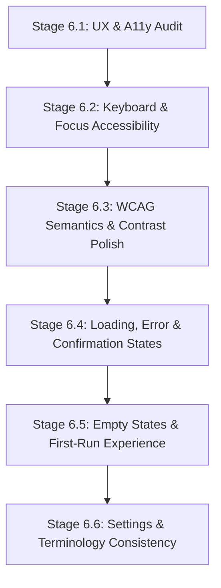

# Stage 6.1: UX & Accessibility Audit Report

**Product:** Kiroku Note (V1.0)  
**Date:** 2026-09-16  
**Stage:** Stage 6.1 — Audit & Design  
**Status:** COMPLETE (Audit Only — Zero source code modifications)  
**Baseline Verified:** 231/231 Backend Tests Passing | 28/28 Extension Suites Passing  

---

## Executive Summary

Following the completion of Stage 5 (Media De-duplication, Learner-focused Anki Card Scoped CSS, Live Side Panel Anki Preview, and Final Live Anki Regression Verification), this audit evaluates the Kiroku Note user experience and accessibility across the entire application lifecycle.

Kiroku Note's core architecture—a dark, precision developer/learner utility running in a 320px–600px Chromium Side Panel with local-first SQLite persistence and explicit Anki synchronization—provides a rock-solid, responsive foundation. However, several UX rough edges, accessibility gaps under WCAG 2.1 AA, missing loading/error indicators, and unannounced screen reader states must be addressed in Stage 6 to elevate Kiroku Note to a polished, professional public release.

**Critical Policy Reminder:** In accordance with explicit user constraints, **no new keyboard shortcuts** are proposed. All keyboard recommendations focus strictly on native control usability (logical Tab ordering, high-contrast focus rings, standard form accessibility, and keyboard navigation of existing controls).

---

## 1. Current UX & User Journey Assessment

### 1.1 First Launch Experience
* **Current Initial State:** When a user installs the extension and opens the Side Panel for the first time:
  * The header displays the eyebrow `KIROKU NOTE` and two connection indicator pills: Yomitan (`Yomitan: Ready`) and Anki (`Anki: Checking…` -> `Anki: Connected` / `Anki: Not connected`).
  * The navigation tab defaults to **Text Mining**.
  * The hero display shows a blank state (`—` with no reading).
  * The card editor form (`#card-editor`) is **completely hidden** (`hidden="true"`).
  * The card preview section shows: `"Preview will appear as you capture or edit a card."`
  * The history section shows: `"No saved cards yet."`
* **UX Friction Points:**
  1. **Lack of Initial Orientation:** A new user opening the Side Panel sees a largely empty panel with no introductory explanation of how the system works or what external services are required (FastAPI backend on `:8000`, Yomitan with local API on `:19633`, and Anki Desktop with AnkiConnect on `:8765`).
  2. **Hidden Card Editor:** Hiding `#card-editor` entirely until the first capture means a user cannot pre-configure their target deck, note type, or Japanese font before starting to mine.
  3. **Silent Backend Requirement:** If the FastAPI backend is not running at all, the indicators show Yomitan as "Ready" initially (hardcoded initial call) until a fetch fails, causing confusion about whether the extension is operational.

### 1.2 Japanese Text Capture Workflow
* **Current Flow:** User clicks "Start mining" (or toggles mining mode), selects Japanese text on any webpage. The content script dispatches `JAPANESE_TEXT_CAPTURED` -> Side Panel calls `POST /api/capture` -> displays card draft.
* **UX Strengths:**
  * Request ID guarding (`currentCaptureId`) prevents stale out-of-order race conditions when the user selects words rapidly.
  * Prominent Hero display (`#expression`, `#reading`) updates cleanly.
  * Rich multi-dictionary entries render with Part-of-Speech badges, pitch downstep badges, frequency ranks, and JLPT level indicators.
  * Safe DOM construction prevents XSS.
* **UX Friction Points:**
  1. **Loading State Visibility:** When a capture is in-flight, `#capture-status` changes to `"Identifying selection…"` and Yomitan indicator switches to `"checking"`, but there is no inline spinner or skeleton shimmer in the hero card or dictionary view.
  2. **Zero-Result / Unknown Word Handling:** When Yomitan returns zero dictionary results for a captured string (e.g., proper nouns, mis-segmented text, or slang), the hero still shows the raw text, but the dictionary section quietly remains blank without a helpful diagnostic ("No dictionary entries found for this term").

### 1.3 Card Editing & Staging
* **Current Flow:** User edits Expression, Reading, Meaning, or expands Optional Fields (Hint, Example sentence, Example translation, Image, Audio, Tags, Notes). User clicks "Save Card" -> calls `POST /api/cards/save`. Then clicks "Send to Anki" -> calls `POST /api/cards/{id}/sync`.
* **UX Strengths:**
  * Clean form controls styled with Precision Dark Utility tokens.
  * Real-time live card preview updates reactively (debounced 40ms) as the user types into any field.
  * Explicit separation between local SQLite save and AnkiConnect push preserves offline-first architecture.
  * Duplicate detection properly displays an `ALREADY SAVED` warning badge without overwriting data unexpectedly.
* **UX Friction Points:**
  1. **Unsaved / Dirty State Feedback:** If a user edits fields on a saved card, there is no visual indicator (e.g. "Unsaved changes") showing that the current form contents differ from the persisted SQLite record until "Save Card" is clicked.
  2. **Field Placeholder vs Label:** Optional fields like Image and Audio use placeholder text (`URL or path`) rather than explanatory helper text, while Tags uses `e.g. n5, verbs`.
  3. **Form Submission Feedback:** While saving, the button changes to `"Saving…"`, which is good; however, if the save fails due to network outage, the button resets immediately and error text in the status bar can be overlooked.

### 1.4 Dictionary Study View & Quick Actions
* **Current Flow:** Shows structured dictionary entries with progressive disclosure (first 4 senses shown, remainder tucked in an accordion). Quick-Insert buttons allow 1-click replacement of Meaning or Example sentence.
* **UX Strengths:**
  * High-density, learner-friendly typography.
  * Progressive disclosure prevents endless scrolling on polysemous words (e.g. 掛ける with 20+ senses).
  * 1-click Quick-Insert buttons provide immediate visual feedback (`"Inserted!"` with green badge transition).
* **UX Friction Points:**
  1. **Browser Native `window.confirm` Modal:** When replacing an existing Meaning or Example sentence via Quick-Insert, the code uses browser-native `window.confirm()`. This freezes the entire tab, cannot be styled in dark mode, and breaks keyboard flow.
  2. **Full Dict vs Study View Toggle:** The button labeled `"Full Dict"` switches to a raw view, but the raw view lacks quick-insert actions and formatted badges.

### 1.5 Media Previews (Screenshots & Audio)
* **Current Flow:** In Video Mining mode, capturing Japanese text automatically triggers video frame screenshot and sentence audio extraction into `#image-preview` and `#audio-preview`.
* **UX Strengths:**
  * Clean, compact media preview cards with action buttons (Replay, Clear).
  * Granular status badges: `Ready`, `Pending…` (pulsing), `Expired (>30s)`, `Discontinuity`, `DRM Restricted`, `Unavailable`.
  * Idempotent media attachment and deduplication across re-saves.
* **UX Friction Points:**
  1. **Audio Player Styling:** Standard HTML5 `<audio>` controls have inconsistent dark styling across Chromium revisions.
  2. **DRM Warning Clarity:** When capturing DRM-protected video (e.g., Netflix), the UI shows "Image unavailable for this source", but doesn't explain that text mining and manual subtitle card creation still work normally.

### 1.6 History & Card Library
* **Current Flow:** Lists last 50 cards from SQLite with search input, deck filter dropdown, and sync status filter dropdown. Clicking a card loads it back into the editor and preview.
* **UX Strengths:**
  * Instant search debounce (250ms).
  * Direct "Retry" button for failed sync cards.
  * Delete local card with confirmation.
* **UX Friction Points:**
  1. **Nested Interactive Elements (Accessibility Violation):** In `renderHistoryCards()`, the `.history-item` container is given `tabIndex="0"` and `role="button"`, but it contains nested `<button>` elements (`.btn-history-retry` and `.btn-history-delete`). This creates invalid accessibility tree semantics.
  2. **Browser Native Confirm on Delete:** `deleteLocalCard` uses `window.confirm()`.
  3. **No Pagination / Load More:** Limit is hardcoded to 50 cards with offset 0; large collections cannot page beyond 50 cards in the Side Panel UI.

---

## 2. Keyboard Accessibility Findings (Without Shortcuts)

Evaluating standard keyboard navigation (Tab, Shift+Tab, Enter, Space, Escape, Arrow keys):

| Component / Area | Issue Description | Severity | WCAG Success Criteria |
| :--- | :--- | :--- | :--- |
| **History Items** | `.history-item` is focusable via Tab, but has **no visible focus indicator** in `sidepanel.css` (lacks `:focus-visible` outline). | **High** | 2.4.7 Focus Visible (AA) |
| **Interactive Buttons** | Multiple buttons (`.btn-subtitles`, `.btn-clear-subtitles`, `.btn-offset`, `.btn-dict-action`, `.btn-history-retry`, `.btn-history-delete`) lack explicit `:focus-visible` styles matching the orange `--border-focus` design token. | **High** | 2.4.7 Focus Visible (AA) |
| **Tab Navigation** | Navigation tabs (`#tab-btn-text`, `#tab-btn-video`) and Preview tabs (`#preview-tab-front`, `#preview-tab-back`) operate on Click/Enter, but do not support standard Left/Right arrow key navigation within `role="tablist"`. | **Medium** | 2.1.1 Keyboard (A) |
| **Accordion Summaries** | `<summary>` elements in dictionary view (`.study-examples-summary`, `.senses-overflow-summary`) are keyboard operable with Enter/Space, but focus ring is clipped by parent overflow on narrow screens. | **Low** | 2.4.7 Focus Visible (AA) |
| **Tab Order Sequence** | Focus flows logically: Header -> Tabs -> Mining Bar -> Hero -> Card Editor Form -> Preview -> Dictionary -> History. Tab order is natural and sequential. | **Pass** | 2.4.3 Focus Order (A) |
| **Escape Key Handling** | Escape key cleanly collapses Optional Fields if expanded. | **Pass** | 2.1.1 Keyboard (A) |

---

## 3. WCAG 2.1 AA Semantic & Structural Accessibility Findings

### 3.1 Landmark & Heading Hierarchy
* **Current Headings:** Only one `<h1>` (`#expression`) exists. Inside `#dict-raw-view`, `<h3>` tags are used directly.
* **Gaps:** Major sections (Card Editor, Card Preview, Dictionary, History) use `<span class="section-title">` instead of semantic `<h2>` headings. Screen readers navigating by heading landmarks cannot jump between functional areas.
* **Recommendation:** Change section headers to `<h2 class="section-title">` styled with existing `.section-title` CSS rules.

### 3.2 ARIA & Screen Reader Semantics
* **Live Regions:**
  * `#dictionary-section` currently has `aria-live="polite"`. When a user mines a word, the entire dictionary DOM is replaced, causing screen readers to re-read large lists of senses. Live region should instead be restricted to `#capture-status`.
* **State & Relationship Attributes:**
  * `#toggle-optional` has `aria-expanded="false"`, but lacks `aria-controls="optional-fields"`.
  * `#preview-tab-front` and `#preview-tab-back` have `role="tab"` and `aria-selected`, but lack `aria-controls="card-preview-container"`.
  * Connection indicators (`#indicator-yomitan`, `#indicator-anki`) have `title` and `aria-label`, but state transitions (e.g. connecting -> failed) are not announced.

### 3.3 Form Accessibility
* All form fields in `#card-editor` have explicit `<label for="...">` associations matching input IDs.
* Required fields: `#field-expression` has `required` attribute.
* Hidden inputs are correctly marked as `<input type="hidden">`.
* Search and filter dropdowns have accessible labels (`aria-label="Search cards"`, `aria-label="Filter by deck"`, `aria-label="Filter by sync status"`).

### 3.4 Color Contrast Analysis (Dark Theme Tokens)
* Tested against WCAG 2.1 Level AA (4.5:1 for normal text, 3.0:1 for large text/UI components):
  * Primary text `--text-primary` (`#f5f4f0`) on Canvas (`#121110`): **17.5:1** (Passes AAA)
  * Secondary text `--text-secondary` (`#b5b1a7`) on Surface 1 (`#191816`): **8.2:1** (Passes AAA)
  * Kana reading accent `--accent-reading` (`#dca566`) on Canvas (`#121110`): **7.4:1** (Passes AAA)
  * JLPT blue accent `--accent-jlpt` (`#7aa2f7`) on Canvas (`#121110`): **6.8:1** (Passes AAA)
  * Terracotta accent `--accent-primary` (`#d97757`) on Canvas (`#121110`): **4.8:1** (Passes AA)
  * **Contrast Issue:** `--text-muted` (`#7d7971`) on Surface 1 (`#191816`): **3.8:1**. For normal 11px/12px text (timestamps, hints, subtitles status), this falls below the 4.5:1 threshold.
  * **Recommendation:** Adjust `--text-muted` from `#7d7971` to `#8e8a81` (**4.65:1**, passes AA).

### 3.5 Motion & Animation
* `.media-status-pill.badge-pending` uses `@keyframes pulse-soft` (1.8s loop).
* **Gap:** No `@media (prefers-reduced-motion: reduce)` block is present in `sidepanel.css`.
* **Recommendation:** Add `@media (prefers-reduced-motion: reduce)` to disable transitions and pause keyframe animations.

---

## 4. Error & Loading State Inventory

Every asynchronous operation in the Side Panel was audited across its five lifecycle states:

```
+----------------------------------------------------------------------------------------------------+
|                                    ASYNC OPERATION LIFECYCLE INVENTORY                             |
+----------------------------------------------------------------------------------------------------+
| 1. Yomitan Capture & Lookup (POST /api/capture)                                                    |
|    - Idle: Status text "Select Japanese text after starting mining."                               |
|    - In-Flight: Yomitan pill 'checking', status "Identifying selection…".                          |
|    - Success: Yomitan pill 'connected', Hero updated, Card Editor populated, Study View rendered.  |
|    - Error: Yomitan pill 'unavailable', status "Cannot connect to backend... / Yomitan error".     |
|    - Recovery: Click "Start mining" or re-select text; retry on reconnect.                         |
|    - Missing Feedback: No inline spinner/skeleton placeholder in Hero or Dictionary area.          |
+----------------------------------------------------------------------------------------------------+
| 2. Card Save (POST /api/cards/save)                                                                |
|    - Idle: Button "Save Card" enabled.                                                             |
|    - In-Flight: Button disabled, text "Saving…".                                                   |
|    - Success: Badge "SAVED", status "Card saved." / "Card updated.", History refreshed.            |
|    - Error: Button re-enabled, status "Save failed: [error message]".                             |
|    - Recovery: Form fields remain intact for immediate user retry.                                 |
|    - Missing Feedback: Error is only reported in small capture banner; no field-level error state. |
+----------------------------------------------------------------------------------------------------+
| 3. Send to Anki / Sync (POST /api/cards/{id}/sync)                                                 |
|    - Idle: Button "Send to Anki", status "Anki: Pending" / "Anki: Ready".                          |
|    - In-Flight: Button disabled, text "Sending…", status "Anki: Syncing…".                         |
|    - Success: Button disabled, text "Sent to Anki", status "Anki: Synced".                         |
|    - Error: Button "Retry Send to Anki" enabled, status "Anki: Failed — retry".                    |
|    - Recovery: Direct click on "Retry Send to Anki" or click on underlined failed status label.    |
|    - Missing Feedback: Fully robust lifecycle. Already verified in Stage 5.                        |
+----------------------------------------------------------------------------------------------------+
| 4. Anki Decks & Models Load (GET /api/anki/decks, GET /api/anki/models)                            |
|    - Idle: Selector populated with stored or fallback defaults ("Default", "Basic").               |
|    - In-Flight: Anki pill 'checking' ("Anki: Checking connection…").                               |
|    - Success: Anki pill 'connected', dropdowns populated with real user decks and note types.      |
|    - Error: Anki pill 'unavailable' ("Anki: Not connected"), fallback "Default" / "Basic" retained.|
|    - Recovery: Background retry on next panel focus or capture.                                    |
|    - Missing Feedback: No explicit "Anki Desktop not running" prompt near the Deck selector.       |
+----------------------------------------------------------------------------------------------------+
| 5. History Query & Filter (GET /api/cards)                                                         |
|    - Idle: Card list populated or empty state shown.                                               |
|    - In-Flight: Debounced 250ms fetch; no visible loading skeleton.                                |
|    - Success: Rendered history items + total count ("X cards").                                    |
|    - Error: Shows "#history-empty" with text "Failed to load history."                             |
|    - Recovery: User re-types search or toggles filters.                                            |
|    - Missing Feedback: No "Retry" button when history fetch fails.                                 |
+----------------------------------------------------------------------------------------------------+
| 6. History Card Deletion (DELETE /api/cards/{id})                                                  |
|    - Idle: Delete button (&times;) visible on card hover/focus.                                    |
|    - In-Flight: Synchronous confirmation modal -> immediate fetch.                                |
|    - Success: Card removed from list, count decremented, editor cleared if open.                   |
|    - Error: Status "Delete failed: [error]".                                                       |
|    - Recovery: Card remains in list for retry.                                                     |
|    - Missing Feedback: Uses blocking native window.confirm() modal.                                |
+----------------------------------------------------------------------------------------------------+
```

---

## 5. Empty-State Inventory

| State Location | Current UI Message | What is Empty? | Why is it Empty? | What Can the User Do Next? | Improvement Needed |
| :--- | :--- | :--- | :--- | :--- | :--- |
| **Initial Launch (Hero)** | Expression shows `—`, reading empty | No word captured yet | Mining mode is off or no text selected | Explains: "Select Japanese text after starting mining." | **Medium**: Add clear 1-2-3 step guide on first launch. |
| **Card Editor** | Entire form is `hidden` | Editor form | No capture initiated | None visible | **High**: Allow editor to be visible or provide explicit placeholder. |
| **Card Preview** | `"Preview will appear as you capture or edit a card."` | Anki card preview | No expression/meaning data | Clear and accurate | **Pass**: Already good. |
| **Dictionary Study View** | Section is empty (`display: none`) | Dictionary senses | No lookup performed | None | **Medium**: If lookup returns 0 entries, display "No dictionary matches". |
| **History (Fresh Install)**| `"No saved cards yet."` | SQLite database | Fresh installation | "Cards you mine and save will appear here." | **Medium**: Clarify that cards are saved locally first. |
| **History (Search/Filter)**| `"No matching cards found."` | Filtered list | No cards match query | Clear and accurate | **Pass**: Already good. |
| **Subtitles (Video Mining)**| Status pill: `"No subtitles"`, Preview: `"—"` | External subtitles | No .srt/.vtt file loaded | Button "Load Subtitles (.srt, .vtt)" is prominent | **Pass**: Already good. |
| **Media Previews** | Dashed placeholders: `"No frame captured"`, `"No audio clip"` | Screenshot / Audio | Not in video mode or DRM restricted | Clear visual icon and explanation | **Pass**: Already good. |

---

## 6. First-Run Onboarding Assessment

### 6.1 Evaluation
Kiroku Note is targeted at Japanese learners and developers who want a fast, local-first mining tool (sub-10-second capture flow). It should **not** have a bloated, multi-step cloud onboarding wizard. However, first-time users need answers to four basic questions:
1. **What is Kiroku Note?** (Local-first Japanese vocabulary mining tool).
2. **What services must be running?**
   * Local Python backend: `http://127.0.0.1:8000` (FastAPI)
   * Yomitan: Local extension with dictionary installed
   * Anki Desktop: With AnkiConnect addon (port `8765`)
3. **How do I capture a word?** (Click "Start mining" -> highlight Japanese text on any webpage -> edit -> Save -> Send to Anki).
4. **Where does my data live?** (In local SQLite on your machine; never sent to third-party cloud).

### 6.2 Recommended First-Run Design
* A compact, collapsible **"Getting Started"** banner or quick-start guide rendered only when history is empty (0 cards saved) and no capture is active.
* Dismissible with a simple "Got it" action.
* Displays live service health badges (Backend, Yomitan, Anki) with 1-click status check.

---

## 7. Settings & Preferences Assessment

### 7.1 Existing Preferences Audit

| Preference Key | Storage Location | Current Default | UI Control Location | Survives Restart? | Status |
| :--- | :--- | :--- | :--- | :--- | :--- |
| `last_used_deck` | `chrome.storage.local` / `localStorage` | `"Default"` | `#field-deck-select` | Yes | **Good** |
| `preferred_anki_model` | `chrome.storage.local` / `localStorage` | First model / `"Basic"` | `#field-model-select` | Yes | **Good** |
| `preferred_japanese_font` | `chrome.storage.local` / `localStorage` | `"Noto Sans JP"` | `#field-font-select` | Yes | **Good** |
| `active_mining_tab` | `chrome.storage.local` / `localStorage` | `"text"` | `#tab-btn-text` / `#tab-btn-video` | Yes | **Good** |
| `subtitle_timing_offset` | `chrome.storage.local` / `localStorage` | `0` (ms) | `#offset-display` buttons | Yes | **Good** |
| `auto_pause_on_hover` | `chrome.storage.local` / `localStorage` | `false` | `#toggle-auto-pause-hover` | Yes | **Good** |
| `auto_capture_frame` | `chrome.storage.local` / `localStorage` | `true` | `#toggle-auto-capture-frame` | Yes | **Good** |
| `auto_capture_audio` | `chrome.storage.local` / `localStorage` | `true` | `#toggle-auto-capture-audio` | Yes | **Good** |

### 7.2 Findings & Recommendations
* The current inline preference management is fast, lightweight, and completely local.
* All settings cleanly survive browser restarts and handle fallbacks between `chrome.storage.local` and `localStorage`.
* **No large settings page is needed for V1.**
* Small improvement: Provide an optional quick connection test or help tooltip explaining the default endpoints (`127.0.0.1:8000`, `127.0.0.1:8765`, `127.0.0.1:19633`).

---

## 8. Terminology & UX Consistency Findings

| Current Variation A | Current Variation B | Recommended Standard Term | Rationale |
| :--- | :--- | :--- | :--- |
| `"Send to Anki"` (Button) | `"Sync to Anki"` / `"Card sent to Anki"` | **"Send to Anki"** (Action) / **"Synced"** (State) | "Send to Anki" accurately communicates the user-initiated push. |
| `"Note Type"` (Form label) | `"model"` / `"model_name"` (Backend) | **"Note Type"** (UI) | Standard Anki Desktop terminology for users. |
| `"Expression"` (Form label) | `"Term"` (Raw dictionary) | **"Expression"** | Consistent with Japanese mining conventions (kanji/kana term). |
| `"Meaning"` (Form label) | `"Definition"` / `"Glosses"` | **"Meaning"** | Clear, universal learner term. |
| `"ALREADY SAVED"` (Badge) | `"SAVED"` (Badge) | **"ALREADY SAVED"** / **"SAVED"** | Clear distinction between duplicate alert and new card confirmation. |
| `"Cards this session: X"` | `"X cards"` (History count) | **"Cards this session: X"** | Clear session counter semantics. |

---

## 9. Prioritized Issues Summary

### Critical (0 Issues)
* *No critical blocking defects.* The pipeline is fully functional and all automated tests pass.

### High Priority (Must Address in Stage 6)
1. **Focus Visibility for Interactive Controls:** Add high-contrast `:focus-visible` outline rings to history items, history action buttons, video mining controls, dictionary action buttons, and preview tabs.
2. **Invalid Nested Interactive Elements in History:** Refactor `.history-item` DOM so that delete and retry buttons are not nested inside a `role="button"` container.
3. **Replace Blocking `window.confirm()` Dialogs:** Replace native blocking modals in Quick-Insert and Delete Card with non-blocking, inline or styled accessible confirmations.
4. **WCAG Heading Structure:** Upgrade section titles to semantic `<h2>` elements to allow screen reader landmark navigation.

### Medium Priority (Stage 6 Polish)
5. **Muted Text Contrast Adjustment:** Bump `--text-muted` from `#7d7971` to `#8e8a81` to satisfy WCAG 2.1 AA 4.5:1 ratio.
6. **ARIA Relationship & Live Region Scoping:** Add `aria-controls` to collapsible optional fields and preview tabs; restrict `aria-live` to the status banner rather than the entire dictionary container.
7. **Reduced Motion Support:** Add `@media (prefers-reduced-motion: reduce)` to disable animations on pending pills and transitions.
8. **First-Run Onboarding Guidance:** Add a clean, lightweight, non-intrusive Quick Start card when history is empty.
9. **Zero Dictionary Results Feedback:** Display an explicit message ("No dictionary entries found") when a capture yields no dictionary results.

### Low Priority (Visual & Micro-Polish)
10. **History Pagination Indicator:** Clarify when the history view shows the 50 most recent cards.
11. **Audio Player Styling Uniformity:** Ensure audio element height and margins are uniform across compact widths (320px–360px).

### Already Good / No Action Needed
* Precision Dark Utility tokens and typography hierarchy.
* XSS-safe DOM construction for dictionary and Anki card preview.
* SQLite-first persistence and explicit Anki sync state machine.
* Responsive layouts across 320px, 400px, and 600px panel widths.
* Zero external framework overhead (100% vanilla HTML/CSS/JS).

---

## 10. Staged Implementation Plan for Stage 6

To maintain regression safety and clean testability, Stage 6 should be executed in 5 focused, sequential sub-stages:



---

### Stage 6.2 — Keyboard & Focus Accessibility
* **Scope:**
  * Ensure every interactive element in the Side Panel has a prominent, high-contrast focus indicator (`outline: 2px solid var(--border-focus); outline-offset: 1px/2px`).
  * Fix `.history-item` DOM structure to eliminate nested interactive button accessibility violations.
  * Add standard Left/Right arrow key navigation to Tablists (Mining mode tabs and Preview tabs).
* **Files Likely to Change:**
  * `extension/sidepanel/sidepanel.css`
  * `extension/sidepanel/sidepanel.js`
  * `extension/sidepanel/sidepanel.html`
* **Tests Required:**
  * `extension/tests/sidepanel.test.js` (update DOM assertion checks)
  * New or expanded tests for keyboard focusable elements and tablist navigation.
* **Manual Verification:**
  * Complete full Tab-only pass through the Side Panel without touching mouse; verify visible orange focus ring on every control.
* **Invariants to Preserve:**
  * Do NOT add keyboard shortcuts. Preserve existing shortcuts (Ctrl+Enter, Ctrl+K, Ctrl+Shift+M, Esc).

---

### Stage 6.3 — WCAG Semantics & Contrast Polish
* **Scope:**
  * Upgrade section headers (`CARD`, `CARD PREVIEW`, `DICTIONARY`, `HISTORY`) from `<span>` to semantic `<h2 class="section-title">`.
  * Adjust `--text-muted` contrast token to `#8e8a81` to achieve full WCAG 2.1 AA (4.65:1) compliance.
  * Add `@media (prefers-reduced-motion: reduce)` rules for pulsing badges and transitions.
  * Add `aria-controls` to toggle buttons (`#toggle-optional`, preview tabs).
  * Scope `aria-live="polite"` strictly to status announcement regions.
* **Files Likely to Change:**
  * `extension/sidepanel/sidepanel.html`
  * `extension/sidepanel/sidepanel.css`
  * `extension/sidepanel/sidepanel.js`
* **Tests Required:**
  * Extension DOM verification tests for semantic headings and ARIA attributes.
* **Manual Verification:**
  * Verify screen reader accessibility tree and contrast with Chrome DevTools accessibility inspector.

---

### Stage 6.4 — Loading, Error & Confirmation States
* **Scope:**
  * Replace native `window.confirm()` in Quick-Insert and Delete Card with non-blocking inline dark-utility confirmation prompts.
  * Add subtle loading skeleton / in-flight shimmer states during capture identification and dictionary loading.
  * Enhance error feedback when background services (backend, Anki, Yomitan) are unreachable, with actionable diagnostic text.
* **Files Likely to Change:**
  * `extension/sidepanel/sidepanel.html`
  * `extension/sidepanel/sidepanel.css`
  * `extension/sidepanel/sidepanel.js`
* **Tests Required:**
  * Extension unit tests for inline confirmation flows and error state transitions.
* **Manual Verification:**
  * Test Quick-Insert replacement, card deletion, and simulated network failure during save/sync.

---

### Stage 6.5 — Empty States & First-Run Experience
* **Scope:**
  * Implement lightweight, non-intrusive "Quick Start" guide for new users when 0 cards exist in history.
  * Add explicit empty state when Yomitan returns 0 matching dictionary entries for a captured term.
  * Clarify local-first SQLite storage and Anki sync in history empty state.
* **Files Likely to Change:**
  * `extension/sidepanel/sidepanel.html`
  * `extension/sidepanel/sidepanel.css`
  * `extension/sidepanel/sidepanel.js`
* **Tests Required:**
  * Extension tests for empty state rendering and dismissible first-run card.
* **Manual Verification:**
  * Test clean profile first-launch appearance and capture transition.

---

### Stage 6.6 — Settings & Terminology Consistency
* **Scope:**
  * Audit all UI labels, button text, status announcements, and tooltips for exact terminology alignment ("Send to Anki", "Note Type", "Expression", "Meaning", "Cards this session").
  * Ensure preference persistence keys (`last_used_deck`, `preferred_anki_model`, `preferred_japanese_font`, etc.) remain 100% backwards-compatible.
* **Files Likely to Change:**
  * `extension/sidepanel/sidepanel.html`
  * `extension/sidepanel/sidepanel.js`
* **Tests Required:**
  * Full regression test run across all 28 extension test suites and 231 backend tests.
* **Manual Verification:**
  * Final smoke test of end-to-end mining workflow.

---

## 11. Audit Conclusion & Handoff

Stage 6.1 Audit is complete. The system architecture, test suite baseline (231/231 backend, 28/28 extension suites), and local-first contracts remain pristine.

**Next Step:** Awaiting user review and approval of this audit report and staged plan before beginning **Stage 6.2 (Keyboard & Focus Accessibility)**.
