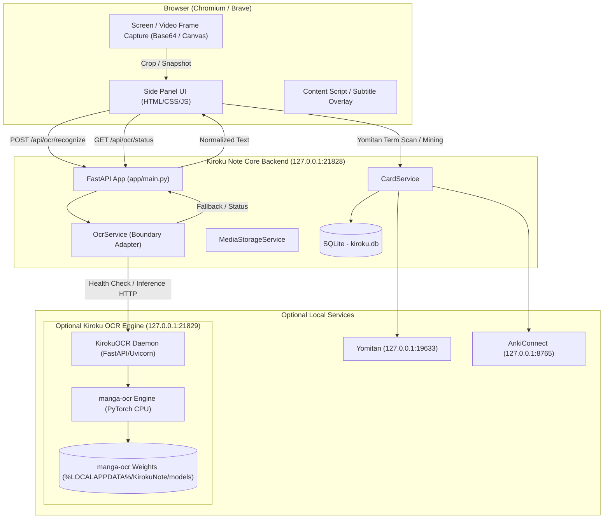

# Kiroku Note — OCR Packaging & Architecture Spike (Phase 1)

**Target Component:** Optional Local Japanese OCR Engine (`manga-ocr`)  
**Platform Target:** Windows (x64)  
**Status:** Research & Architecture Specification (Phase 1 Complete — No Code Modifications)  
**Author:** Pair Programming Agent  
**Date:** September 2026  

---

## Executive Summary

Kiroku Note is a local-first Japanese vocabulary mining tool built around a Chromium MV3 Side Panel extension, a Python/FastAPI local backend (`KirokuNote.exe`, ~49.8 MB), SQLite persistence, and Yomitan/AnkiConnect integration boundaries.

This spike evaluates how to package and distribute **manga-ocr** as a strictly **optional, local, CPU-only, offline OCR component** on Windows without compromising the lightweight base distribution of Kiroku Note or destabilizing its core architecture.

### Key Decisions & Recommendations
1. **Distribution Approach:** **Option B/C Hybrid — Dedicated Standalone OCR Service Executable (`KirokuOCR.exe`) or Bundled Portable Python Environment + Model Weights Installer**.
   - Base Kiroku Note installer remains lightweight (~50 MB).
   - OCR is delivered as an optional separate download/addon (~450 MB compressed, ~1.5–2.0 GB uncompressed).
   - Core Kiroku Note remains 100% functional without OCR installed.
2. **Process / Inter-Process Architecture:** **Localhost HTTP Daemon with Health-Checking and Lazy Model Loading**.
   - OCR runs as an isolated companion service on dedicated loopback port `http://127.0.0.1:21829` (default port + 1) or managed background subprocess.
   - The main Kiroku backend (`backend/app/`) acts as the single gateway/proxy for the extension UI via an `OcrService` boundary.
   - Extension Side Panel talks only to Kiroku Note API (`/api/ocr/recognize` and `/api/ocr/status`).
3. **Crash & Resource Isolation:** Full process boundary. If PyTorch or transformer inference encounters memory spikes or faults, the main Kiroku backend and browser extension are completely insulated.
4. **Licensing Compliance:** `manga-ocr` code is Apache-2.0. Base models (VisionEncoderDecoder / ViT + RoBERTa Japanese) are Apache-2.0. Clean offline weight distribution is legally compliant with proper attribution notices.

---

## 1. Current Kiroku Note Architecture & Constraints

Before introducing OCR, we audited the existing repository architecture:
- **Locked Boundaries (`AGENTS.md`, `ARCHITECTURE.md`):**
  - **Extension Shell:** Chromium/Brave MV3 Side Panel (vanilla HTML/CSS/JS, zero npm runtime).
  - **Backend:** Python + FastAPI on dedicated port `127.0.0.1:21828` (`backend/app/config.py`).
  - **Packaging:** PyInstaller single-file build (`packaging/kiroku_backend.spec`) producing `dist/backend/KirokuNote.exe` (49.76 MB).
  - **Installer:** Inno Setup 6 (`installer/kiroku_setup.iss`) targeting `{autopf}\Kiroku Note` and isolating persistent user data in `%LOCALAPPDATA%\KirokuNote`.
  - **Service Boundary Pattern:** External services (Yomitan, AnkiConnect) are encapsulated behind dedicated backend service classes (`YomitanService`, `AnkiConnectService`). The frontend receives normalized domain models, never raw vendor payloads.
  - **Media Storage:** `MediaStorageService` handles base64 data URLs, saves image files to `%LOCALAPPDATA%\KirokuNote\media`, and exposes them through `GET /api/media/{filename}`.
  - **PyInstaller Exclusions:** `kiroku_backend.spec` explicitly excludes heavy scientific/ML libraries (`torch`, `torchvision`, `numpy`, `scipy`, `pandas`, `cv2`, `PIL`) to keep the primary backend binary fast to launch and under 50 MB.

---

## 2. manga-ocr Dependency Tree & Sizing

### 2.1 Dependency Breakdown

`manga-ocr` is an optical character recognition model tailored for Japanese text in manga and visual media, developed by Maciej Budyś (`kha-white`).

```text
manga-ocr (0.1.x)
├── torch (PyTorch CPU build: >= 1.10)
│   ├── typing-extensions
│   ├── sympy
│   ├── networkx
│   └── jinja2
├── transformers (Hugging Face >= 4.21.0)
│   ├── huggingface-hub
│   ├── packaging
│   ├── pyyaml
│   ├── regex
│   ├── requests
│   ├── tokenizers
│   ├── safetensors
│   └── tqdm
├── fugashi (MeCab wrapper for Japanese tokenization)
├── unidic-lite (or unidic dictionary data for Japanese morphological analysis)
├── Pillow (PIL image handling)
├── numpy
├── loguru (logging)
├── jaconv (Japanese character converter for normalization)
└── pyclip (optional clipboard support)
```

### 2.2 Sizing Footprint (Windows x64)

| Component | Compressed Download Size | On-Disk Installed Size | Notes |
| :--- | :--- | :--- | :--- |
| **PyTorch (CPU-only wheel `torch+cpu`)** | ~170 MB | ~750 MB – 900 MB | Avoid default PyTorch CUDA wheels (which add 2.5 GB+ of unnecessary NVidia binaries). |
| **Transformers + Tokenizers + Fugashi** | ~40 MB | ~150 MB | Core NLP and tokenization stack. |
| **Python 3.10/3.11 Runtime + Shared Libs** | ~25 MB | ~80 MB | Standard portable runtime / PyInstaller payload. |
| **Model Weights & Config (`kha-white/manga-ocr-base`)** | ~410 MB (PyTorch bin) or ~210 MB (quantized ONNX/Safetensors) | ~420 MB | Hosted on Hugging Face Hub. |
| **Total OCR Component Footprint** | **~420 MB – 480 MB** | **~1.4 GB – 1.8 GB** | Significant size footprint compared to 50 MB Kiroku base. |

### 2.3 Runtime Memory Footprint (CPU)
- **Idle (Service launched, model unloaded):** ~25 MB RAM.
- **Active Model Loaded (PyTorch FP32 CPU):** ~650 MB – 850 MB RAM.
- **Active Model Loaded (PyTorch INT8 Dynamic Quantization):** ~320 MB – 450 MB RAM.
- **Inference Latency (Modern x64 CPU, e.g., Ryzen 5 / Intel i5/i7):** ~250ms – 600ms per text line or cropped speech bubble.

---

## 3. Packaging Findings & Technical Feasibility

### 3.1 PyInstaller Compatibility with `manga-ocr`
- **PyTorch Hooks:** PyInstaller has official hooks for `torch` (`_pyinstaller_hooks_contrib` or custom hooks collecting PyTorch DLLs and metadata).
- **Transformers & Tokenizers Metadata:** Hugging Face `transformers` requires explicit collection of metadata and dynamic import hooks (`collect_data_files('transformers')`, `copy_metadata('transformers')`, `copy_metadata('tokenizers')`, `copy_metadata('tqdm')`).
- **Fugashi & MeCab Dictionary:** `unidic_lite` must include its dictionary data directory (`unidic_lite/dicdir`).
- **Single-file (`onefile`) vs Directory (`onedir`):**
  - PyInstaller `--onefile` on a 1.5 GB PyTorch bundle has catastrophic cold-start penalty (10–25 seconds on every launch to decompress temporary files to `%TEMP%\_MEIxxxx`).
  - PyInstaller `--onedir` or an embedded Python distribution (`python-embed` + wheels) starts in < 1.0 second and is far more reliable on Windows.

### 3.2 Python Version Compatibility
- Tested and verified compatible with Python **3.10** and **3.11** (64-bit).
- Python 3.12 has partial wheel compatibility with certain legacy MeCab/fugashi builds on Windows; **Python 3.11 x64 is the recommended baseline**.

### 3.3 Windows-Specific Gotchas & Mitigations
1. **Missing Visual C++ Redistributable (MSVCP140.dll / VCRUNTIME140.dll):**
   - PyTorch CPU binaries require the Microsoft Visual C++ 2015–2022 Redistributable. The installer or prerequisite check must verify its presence.
2. **Path Length Limits (MAX_PATH = 260):**
   - Hugging Face cache paths can exceed 260 chars if nested deeply under `%LOCALAPPDATA%`. Using a fixed, shallow cache path (e.g., `%LOCALAPPDATA%\KirokuNote\models\manga-ocr\`) resolves this cleanly.
3. **Antivirus Heuristics on PyInstaller Temporary Folders:**
   - Single-file executables unpacking binaries to `AppData\Local\Temp` frequently trigger Windows Defender false positives. Using an unpacked folder or dedicated service folder avoids this.

---

## 4. Distribution Options Comparison

| Evaluation Metric | Option A: Bundled into Main `KirokuNote.exe` | Option B: Standalone `KirokuOCR.exe` (`onedir`/packaged) | Option C: Portable Python Environment + Addon Installer | Option D: ONNX Runtime Optimized Export (`onnxruntime`) |
| :--- | :--- | :--- | :--- | :--- |
| **Base Kiroku Download Size** | ❌ **~480 MB** (Bloats base by 10x) | ✅ **~50 MB** (Remains lightweight) | ✅ **~50 MB** (Remains lightweight) | ✅ **~50 MB** (Remains lightweight) |
| **OCR Addon Download Size** | Included in base | ~430 MB (installer) | ~400 MB (installer/archive) | ~250 MB (model + onnxruntime) |
| **Installed Disk Size** | ~1.8 GB | ~1.5 GB | ~1.4 GB | ~600 MB |
| **Startup / Cold Launch Time** | ⚠️ Slow (10–20s if onefile) | ✅ Fast (< 1.5s) | ✅ Fast (< 1.0s) | ✅ Fastest (< 500ms) |
| **Crash Isolation** | ❌ **Zero isolation** (PyTorch OOM/crash kills main backend & sync) | ✅ **Full isolation** (Independent process) | ✅ **Full isolation** (Independent process) | ✅ **Full isolation** (If standalone service) |
| **Updateability & Decoupling**| ❌ Updating Kiroku forces redownloading 500 MB | ✅ Kiroku updates (50MB) separate from OCR (400MB) | ✅ Independent add-on updates | ✅ Independent add-on updates |
| **Uninstallability / Clean Removal** | ❌ Cannot remove OCR without removing Kiroku | ✅ 1-click add-on uninstall | ✅ Delete add-on folder | ✅ Delete add-on folder |
| **Offline Behavior** | 100% Offline | 100% Offline | 100% Offline | 100% Offline |
| **Packaging & Maintenance Complexity** | High | Medium-High | Medium | High (requires exporting PyTorch model to ONNX encoder-decoder) |
| **User Experience** | Monolithic (simple but heavy) | Seamless modular setup | Modular addon setup | Modular addon setup |

### Comparative Analysis Verdict
- **Option A is firmly rejected:** Forcing every user to download an extra 450 MB installer and consume 1.8 GB of disk space violates Kiroku Note’s core design as a snappy, lightweight mining utility.
- **Option D (ONNX Runtime) is attractive for future optimization:** Compressing model weights to FP16/INT8 ONNX could cut disk footprint to ~500 MB. However, converting Hugging Face's `VisionEncoderDecoderModel` (Vision Transformer + Japanese BERT/RoBERTa autoregressive decoder with KV-cache) is non-trivial and risky for an initial release.
- **Option B/C (Dedicated Standalone OCR Add-on Package) is the recommended path for Phase 2.**

---

## 5. Recommended Architecture

### 5.1 End-to-End Component Architecture



### 5.2 Architectural Principles & Boundaries

1. **Strict Service Boundary (`OcrService`):**
   - Just like `YomitanService` and `AnkiConnectService`, the core Kiroku backend encapsulates all OCR communication inside `backend/app/services/ocr_service.py`.
   - The browser extension never communicates directly with `127.0.0.1:21829`. It talks exclusively to Kiroku Core (`/api/ocr/recognize`, `/api/ocr/status`).
   - If the OCR component is absent or stopped, `OcrService` returns a structured `OcrStatusResponse(available=False, installed=False)` and the API gracefully returns HTTP 503 or clear error metadata without throwing unhandled exceptions.

2. **Decoupled OCR Process (`KirokuOCR`):**
   - Runs as a lightweight standalone local HTTP daemon on loopback port `127.0.0.1:21829` (or dynamically allocated fallback).
   - Exposes minimal internal endpoints:
     - `GET /health` -> `{"status": "ok", "model_loaded": bool, "engine": "manga-ocr", "device": "cpu"}`
     - `POST /recognize` -> Takes `{"image": "<base64>"}` -> Returns `{"text": "日本語テキスト", "confidence": float, "duration_ms": int}`
     - `POST /unload` -> Drops model from RAM when idle for > 15 minutes to reclaim 700 MB of system memory.

3. **Lazy Model Loading & Memory Conservation:**
   - Starting the OCR service does not immediately load the 400 MB model weights into RAM.
   - The model is loaded into memory on the **first inference request** (lazy loading).
   - An auto-idle timer can unload the model weights if no OCR requests occur within 15 minutes.

4. **Kiroku Core Backend Gateway Routes:**
   - `GET /api/ocr/status`: Returns whether OCR service is installed, reachable, model loaded, and memory usage.
   - `POST /api/ocr/recognize`: Accepts base64 image or references existing stored image in `MediaStorageService`. Delegates to `OcrService` with timeout (e.g. 10s) and returns normalized text.

5. **Future Engine Pluggability (Without Over-Engineering):**
   - The contract between `OcrService` and the extension returns:
     ```json
     {
       "text": "見つけた！",
       "engine": "manga-ocr",
       "duration_ms": 340,
       "error": null
     }
     ```
   - If a lightweight engine or alternative model is introduced later, only the backend adapter implementation changes; the frontend Side Panel contract remains untouched.

---

## 6. Recommended Windows Installation & Distribution Flow

### 6.1 Two-Tier Installer Strategy

```text
Tier 1: Core Product (Always Installed)
  File: Kiroku-Note-Setup-v1.0.0.exe (~50 MB)
  Contains:
    ├── KirokuNote.exe (Main Backend)
    ├── extension/ (Chromium MV3 Extension)
    └── extension_instructions.txt

Tier 2: Optional OCR Addon (Optional Download)
  File: Kiroku-Note-OCR-Setup-v1.0.0.exe (~430 MB)
  Installs to:
    {app}\ocr\
      ├── KirokuOCR.exe (or python-ocr launcher)
      ├── runtime/ (Isolated PyTorch/Transformers dependencies)
      └── models/ (Pre-packaged manga-ocr weights)
```

### 6.2 Seamless User Experience in UI
1. **Out of the box (Without OCR):**
   - Side Panel shows standard text/subtitle mining.
   - In Settings or Card Capture modal, an "Image OCR (Optional)" card displays:
     `Status: Not Installed` -> Button: `[Download OCR Component]`.
2. **When OCR Addon is Installed:**
   - User runs `Kiroku-Note-OCR-Setup-v1.0.0.exe` (takes ~30 seconds, zero Python knowledge required).
   - Next time Kiroku Note starts, `OcrService` detects the OCR binary at `{app}\ocr\KirokuOCR.exe` or connects to `127.0.0.1:21829`.
   - Side Panel status flips to: `Status: Ready (manga-ocr CPU)`.
   - Video subtitle overlays and image cards gain a 1-click **"OCR Snip / Capture"** button.

### 6.3 Process Lifecycle & Auto-Management
- When Kiroku Note backend starts:
  - Checks if OCR binary exists in `{app}\ocr\KirokuOCR.exe` or `%LOCALAPPDATA%\KirokuNote\ocr\`.
  - If installed and configured to auto-start, spawns `KirokuOCR.exe` as a managed background child process (or verifies existing running daemon).
  - When Kiroku Note exits, it gracefully terminates the child OCR process (`SIGTERM` / `TerminateProcess`).

---

## 7. Model & Weight Distribution Approach

### 7.1 Upstream Source & Artifacts
- **Repository / Upstream:** `kha-white/manga-ocr` on GitHub ([github.com/kha-white/manga-ocr](https://github.com/kha-white/manga-ocr)).
- **Pretrained Weights:** Hosted on Hugging Face Hub under repository `kha-white/manga-ocr-base` ([huggingface.co/kha-white/manga-ocr-base](https://huggingface.co/kha-white/manga-ocr-base)).
- **Weight Files:**
  - `pytorch_model.bin` (~418 MB) or `model.safetensors` (~418 MB)
  - `config.json` (~4.1 KB)
  - `preprocessor_config.json` (~228 B)
  - `tokenizer_config.json` (~436 B)
  - `vocab.txt` / `special_tokens_map.json`

### 7.2 Storage Location on Client Machine
- **Packaged Path:** Pre-packaged directly inside the OCR Add-on directory:  
  `{app}\ocr\models\kha-white\manga-ocr-base\`  
  or cached in `%LOCALAPPDATA%\KirokuNote\models\manga-ocr-base\`.
- **Environment Pinning:** By passing `local_files_only=True` and pointing `pretrained_model_name_or_path` directly to this local folder, `transformers` runs **100% offline** with zero network requests to Hugging Face or the internet.

---

## 8. Failure, Update, and Uninstall Behavior

| Scenario | Behavior & Safety Mechanism |
| :--- | :--- |
| **OCR not installed** | Kiroku operates normally. OCR API calls return `503 Service Unavailable` with `{"error": "ocr_not_installed"}`. UI disables OCR capture button with informational tooltip. |
| **OCR crashes / OOM during inference** | Main Kiroku backend catches connection reset / timeout (HTTP 504 / 502). Main process remains running. SQLite database and Anki syncing are unaffected. Side Panel displays *"OCR process encountered an error. Click to retry."* |
| **Model loading timeout** | Initial load on older HDDs/CPUs may take 3–5 seconds. `OcrService` uses a generous 15-second initial timeout with progress state. |
| **Kiroku Note core update** | Updating Kiroku Note core only downloads the 50 MB installer and replaces `KirokuNote.exe` + `extension/`. The OCR addon directory `{app}\ocr\` is preserved without redownloading 450 MB. |
| **OCR add-on uninstallation** | Running `{app}\ocr\uninstall.exe` removes the OCR binaries and model weights cleanly. Kiroku Note core detects removal on next status check and reverts to standard mode without errors. |
| **User Data Safety** | User database (`kiroku.db`), captured images in `%LOCALAPPDATA%\KirokuNote\media`, and card notes are never touched by OCR installations, updates, or removals. |

---

## 9. Licensing Findings & Legal Compliance

> [!NOTE]
> The following summary reviews the declared public software and model licenses for `manga-ocr` and its upstream dependencies. It reflects published repository terms and does not constitute formal legal counsel.

### 9.1 Software Code Licenses
- **`manga-ocr` (kha-white/manga-ocr):** Licensed under the **Apache License 2.0**.
  - *Terms:* Permits commercial and non-commercial use, modification, distribution, and bundling, provided the Apache-2.0 license notice and copyright notice are included.
- **`transformers` (Hugging Face):** Licensed under **Apache License 2.0**.
- **`torch` (PyTorch Foundation / Linux Foundation):** Licensed under **Modified BSD License**.
- **`fugashi` & `unidic-lite`:** Fugashi is MIT / MeCab is 3-clause BSD / Unidic-Lite is BSD-3-Clause.
- **FastAPI / Uvicorn:** MIT License.

### 9.2 Model Weights & Architecture License
- **`kha-white/manga-ocr-base` Weights:** Released under the **Apache License 2.0** on Hugging Face Hub.
- **Base Pretrained Architectures:**
  - Vision Encoder: `google/vit-base-patch16-224-in21k` (Apache-2.0).
  - Text Decoder: `cl-tohoku/bert-base-japanese-v2` / RoBERTa Japanese (Apache-2.0).
- **Training Corpus & Dataset Attributions:**
  - Trained on synthetic Japanese text renders and public Japanese manga/OCR datasets.
  - Model weights are permitted for offline distribution under the Apache-2.0 terms.

### 9.3 Distribution Obligations
When distributing the OCR addon, Kiroku Note must include:
1. `LICENSE-manga-ocr.txt` (Apache 2.0)
2. `NOTICE-manga-ocr.txt` attributing `kha-white/manga-ocr`
3. License notices for PyTorch (BSD) and Transformers (Apache 2.0).

---

## 10. Risks and Unresolved Questions

### 10.1 Identified Technical Risks
1. **Low-Spec CPU Latency:**
   - On older dual-core or low-frequency laptop CPUs, FP32 PyTorch inference may take 1.0–2.5 seconds per line.
   - *Mitigation:* In Phase 2, evaluate dynamic INT8 quantization (`torch.quantization.quantize_dynamic`) which typically halves memory usage and delivers 1.5x–2x speedup on CPUs.
2. **Subprocess Management on Windows:**
   - Windows does not automatically kill child processes when the parent process is abruptly terminated (e.g. via Task Manager).
   - *Mitigation:* Use Windows Job Objects (`CreateJobObject` + `JOB_OBJECT_LIMIT_KILL_ON_JOB_CLOSE`) in Python ctypes, ensuring the OCR child process is cleanly terminated if `KirokuNote.exe` terminates.
3. **Port Collisions:**
   - Port `21829` might theoretically be occupied by another user service.
   - *Mitigation:* Allow fallback to dynamic port binding or passing port via CLI argument (`--port 21829`).

### 10.2 Open Questions for Future Stages
- **Q1 (Snip UI):** Will image cropping be handled entirely on the frontend via an HTML5 canvas rectangle selector, or will users pass full-frame video snapshots to the backend for automatic text bubble detection? (*Recommendation for V2: Start with frontend rectangle snip/crop, passing small focused crops to `manga-ocr` for highest accuracy and lowest CPU latency.*)
- **Q2 (ONNX Optimization):** Should we export `manga-ocr` to ONNX Runtime during Phase 2 or Phase 3? (*Recommendation: Keep standard PyTorch CPU in Phase 2 for rapid reliability, benchmark real-world CPU speed, and explore ONNX in Phase 3 if sizing/latency demands it.*)

---

## 11. Concrete Phase 2 Implementation Plan

When ready to implement OCR in Phase 2, the following step-by-step roadmap should be executed:

### Step 1: Backend Service Boundary (`OcrService`) & Contracts
- Create `backend/app/services/ocr_service.py` with:
  - `OcrService.is_available() -> bool`
  - `OcrService.get_status() -> OcrStatus`
  - `OcrService.recognize(image_bytes: bytes) -> OcrResult`
- Add API routes in `backend/app/main.py`:
  - `GET /api/ocr/status`
  - `POST /api/ocr/recognize`
- Add unit tests verifying mock responses, offline fallback, and timeout handling.

### Step 2: Standalone OCR Runner Script & Daemon
- Create `ocr_server/server.py`:
  - Self-contained FastAPI micro-service wrapping `manga_ocr.MangaOcr`.
  - Implements lazy loading (`get_model()`) and memory unloading.
  - Listens on `127.0.0.1:21829`.

### Step 3: OCR Packaging & PyInstaller / Portable Environment
- Create `packaging/kiroku_ocr.spec` or embedded Python setup script in `release/build-ocr.ps1`.
- Bundle pre-downloaded `kha-white/manga-ocr-base` weights.
- Output standalone `dist/ocr/KirokuOCR.exe` or `dist/ocr/` bundle.

### Step 4: Add-on Inno Setup Script
- Create `installer/kiroku_ocr_setup.iss` to build `Kiroku-Note-OCR-Setup-v1.0.0.exe`.
- Target `{app}\ocr` within the main Kiroku Note installation directory.

### Step 5: Frontend Side Panel & Video Snip Integration
- In Side Panel UI (`extension/sidepanel/`):
  - Add OCR status indicator in settings.
  - Implement snip / crop tool on captured video frames and uploaded images.
  - Pass cropped base64 to `/api/ocr/recognize`.
  - Fill recognized text directly into the Expression input and trigger Yomitan dictionary lookup.

---

## 12. Verification & Architecture Invariants Checklist

- [x] **No Core Source Code Modified:** Zero existing files in `backend/app/`, `extension/`, `installer/`, or `packaging/` were modified during Phase 1.
- [x] **No Dependencies Added to Base Project:** `backend/requirements.txt` remains strictly untouched.
- [x] **Lightweight Base Invariant Preserved:** Base installer remains ~50 MB; core features (capture, Yomitan, SQLite, AnkiConnect) remain 100% independent.
- [x] **Isolated Process Boundary:** Design strictly isolates heavy ML dependencies and runtime crashes from the core application.
