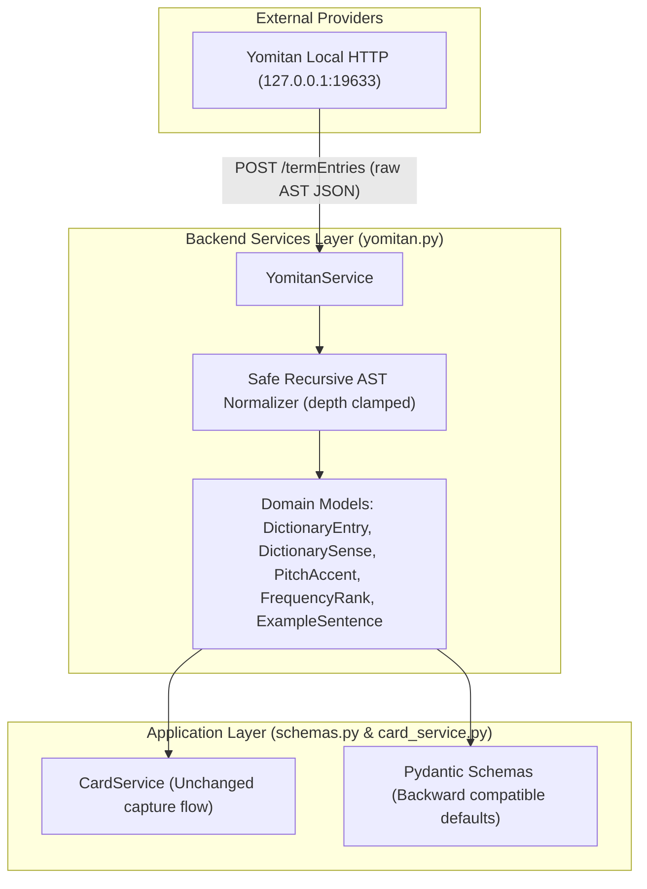

# Stage 3B.1 Implementation Plan: Dictionary Normalization (Backend AST Normalizer + Domain Models)

> **For agentic workers:** REQUIRED SUB-SKILL: Use superpowers:subagent-driven-development to implement this plan task-by-task. Steps use checkbox (`- [ ]`) syntax for tracking.

**Goal:** Establish a robust, provider-neutral dictionary normalization foundation in `backend/app/services/yomitan.py` and `backend/app/schemas.py` that preserves rich linguistic data (senses, sense-bound POS, linguistic/field tags, notes, example sentences with ruby/furigana, pitch accents, frequency ranks) from Yomitan without data loss or crashes, while maintaining 100% backward compatibility for existing external API contracts and consumers.

**Architecture:**
- Create provider-neutral frozen dataclasses: `ExampleSentence`, `PitchAccent`, `FrequencyRank`, `DictionarySense`, `DictionaryEntry`, and `EnrichedTerm` (with backward-compatible type aliases `Example = ExampleSentence` and `Sense = DictionarySense`).
- Implement safe recursive AST normalizer in `YomitanService` with depth clamping, graceful fallback for malformed nodes/dictionaries, sense-level POS/tag binding, and structured content extraction.
- Update `backend/app/schemas.py` with compatible Pydantic models for `PitchAccent`, `FrequencyRank`, `Sense`, `DictionaryEntry`, and `CaptureResponse` so existing serialization and API responses continue to function seamlessly.
- Implement exhaustive unit tests in `backend/tests/test_dictionary_ast.py` and ensure zero regressions across all 135 existing backend tests and 26 extension tests.

**Architecture Diagram:**



**Tech Stack:** Python 3.11, FastAPI, Pydantic, Pytest (Standard Library `dataclasses`, `typing`, `json`, `urllib`).

**Spec:** `V1/Stage3A.md` and User Prompt for Stage 3B.1.

## Global Constraints
- Target only Stage 3B.1 (Backend normalizer + domain models + tests).
- Zero frontend modifications.
- Zero changes to Anki card formatting, subtitle/video/frame/audio systems.
- Zero new external dependencies.
- Preserve 100% backward compatibility with `/api/capture` and `CardService`.
- Recursion depth limit in AST traversal (max depth 32) to prevent stack overflow.

---

### Task 1: Define Domain Models & Dataclasses in `backend/app/services/yomitan.py`

**Files:**
- Modify: `backend/app/services/yomitan.py:1-50`
- Test: `backend/tests/test_dictionary_ast.py`

**Interfaces:**
- Consumes: Standard Python `dataclasses`
- Produces: `ExampleSentence`, `PitchAccent`, `FrequencyRank`, `DictionarySense`, `DictionaryEntry`, `EnrichedTerm`, `IdentifiedTerm` (and aliases `Example = ExampleSentence`, `Sense = DictionarySense`)

- [ ] **Step 1: Write unit test for domain model instantiation and backward-compatible aliases**

```python
# backend/tests/test_dictionary_ast.py
import unittest
from app.services.yomitan import (
    ExampleSentence, Example,
    PitchAccent,
    FrequencyRank,
    DictionarySense, Sense,
    DictionaryEntry,
    EnrichedTerm,
    IdentifiedTerm
)

class TestDictionaryDomainModels(unittest.TestCase):
    def test_domain_model_instantiation(self):
        ex = ExampleSentence(japanese="映画を見る", reading="えいがをみる", translation="watch a movie", source_dictionary="Jitendex")
        self.assertEqual(ex.japanese, "映画を見る")
        self.assertEqual(ex.translation, "watch a movie")
        self.assertIs(Example, ExampleSentence)

        pitch = PitchAccent(reading="えいが", position=0, pattern_name="heiban", nasal_positions=[], devoice_positions=[], dictionary="NHK")
        self.assertEqual(pitch.position, 0)
        self.assertEqual(pitch.pattern_name, "heiban")

        freq = FrequencyRank(dictionary="BCCWJ", frequency=450, display_value="450", rank=450, is_common=True)
        self.assertEqual(freq.rank, 450)

        sense = DictionarySense(
            index=1,
            glosses=["movie", "film"],
            parts_of_speech=["noun"],
            tags=["popular"],
            field_tags=["cinema"],
            notes=["Note: modern term"],
            examples=[ex]
        )
        self.assertEqual(sense.glosses, ["movie", "film"])
        self.assertEqual(sense.parts_of_speech, ["noun"])
        self.assertIs(Sense, DictionarySense)

        entry = DictionaryEntry(
            dictionary="Jitendex.org [2026-08-11]",
            dictionary_alias="Jitendex",
            is_primary=True,
            term="映画",
            reading="えいが",
            alt_terms=["映畫"],
            alt_readings=[],
            parts_of_speech=["noun"],
            tags=["★"],
            senses=[sense],
            pitches=[pitch],
            frequencies=[freq],
            score=200
        )
        self.assertEqual(entry.term, "映画")
        self.assertEqual(entry.senses[0].parts_of_speech, ["noun"])
```

- [ ] **Step 2: Run test to verify it fails**

Run: `python -m pytest backend/tests/test_dictionary_ast.py -v`
Expected: FAIL with `ImportError` or `TypeError` (models not yet defined).

- [ ] **Step 3: Implement domain dataclasses in `backend/app/services/yomitan.py`**

Define `ExampleSentence`, `PitchAccent`, `FrequencyRank`, `DictionarySense`, `DictionaryEntry`, and `EnrichedTerm` with frozen dataclass definitions and default factories, maintaining compatibility with existing `Example` and `Sense` imports.

- [ ] **Step 4: Run test to verify it passes**

Run: `python -m pytest backend/tests/test_dictionary_ast.py -v`
Expected: PASS.

---

### Task 2: Implement Safe Recursive AST Normalizer in `YomitanService`

**Files:**
- Modify: `backend/app/services/yomitan.py:100-188`
- Test: `backend/tests/test_dictionary_ast.py`

**Interfaces:**
- Consumes: Raw Yomitan `/termEntries` JSON payload (from HTTP or fixtures)
- Produces: `list[DictionaryEntry]` with parsed `DictionarySense`, `PitchAccent`, `FrequencyRank`, `ExampleSentence`, sense-bound POS, linguistic/field tags, and notes.

- [ ] **Step 1: Write unit tests covering full normalization capabilities**

Test cases to add:
1. Normal Jitendex/JMdict structured-content entry (multi-sense, ruby examples, POS, tags).
2. Sense-bound parts of speech (Sense 1 = transitive, Sense 2 = intransitive).
3. Monolingual/plain-text entries without sense-groups.
4. Multiple dictionaries with `is_primary`, aliases, and ordering.
5. Pitch accent extraction (`pitches` and `pronunciations` formats, calculation of `pattern_name` e.g., position 0 -> `heiban`, position 1 -> `atamadaka`, position > 1 -> `nakadaka`/`odaka`).
6. Frequency ranking extraction (`frequencies` format with `displayValue`, `frequency`, `rank`).
7. Ruby / furigana preservation in example sentences (extracting Japanese clean text without stripping word characters, and preserving ruby annotations if structured).
8. Missing optional fields, empty definitions, and malformed/partial AST nodes.
9. Protection against excessive recursion depth (depth > 32).
10. Multi-entry list where one entry is corrupted/malformed.

- [ ] **Step 2: Run test to verify it fails**

Run: `python -m pytest backend/tests/test_dictionary_ast.py -k "test_normalize" -v`
Expected: FAIL.

- [ ] **Step 3: Implement the robust AST normalizer in `YomitanService`**

Implement:
- `normalize_term_entries_response(payload: Any) -> list[DictionaryEntry]`
- `_parse_entry(raw: dict[str, Any], default_primary: bool) -> list[DictionaryEntry]`
- `_parse_definition(definition: dict[str, Any], headwords: list[Any], entry_pitches: list[PitchAccent], entry_frequencies: list[FrequencyRank], entry_score: int, is_primary: bool) -> DictionaryEntry`
- `_extract_pitches(raw_entry: dict[str, Any], definition: dict[str, Any]) -> list[PitchAccent]`
- `_extract_frequencies(raw_entry: dict[str, Any], definition: dict[str, Any]) -> list[FrequencyRank]`
- `_extract_senses(definition: dict[str, Any], source_dict: str) -> tuple[list[DictionarySense], list[str]]`
- `_parse_structured_content(content: Any, source_dict: str, depth: int = 0) -> tuple[list[DictionarySense], list[str]]`
- `_parse_sense_node(node: dict[str, Any], inherited_pos: list[str], inherited_tags: list[str], sense_idx: int, source_dict: str) -> DictionarySense`
- `_extract_text(node: Any, depth: int = 0) -> str` (preserving ruby text cleanly)
- `_extract_ruby_sentence(node: Any, depth: int = 0) -> tuple[str, str | None]` (extracting plain surface Japanese and optional ruby reading/furigana)
- Robust fail-soft guards on all dictionary key lookups.

- [ ] **Step 4: Run test to verify it passes**

Run: `python -m pytest backend/tests/test_dictionary_ast.py -v`
Expected: PASS.

---

### Task 3: Update `backend/app/schemas.py` for API Model Compatibility

**Files:**
- Modify: `backend/app/schemas.py:22-70`
- Test: `backend/tests/test_capture_integration.py`, `backend/tests/test_capture_route.py`, `backend/tests/test_cards_api.py`

**Interfaces:**
- Consumes: Dataclass outputs from `YomitanService` and `CardService`
- Produces: Updated Pydantic schemas: `Example`, `Sense`, `DictionaryEntry`, `PitchAccentSchema`, `FrequencyRankSchema`, `CaptureResponse` with `jlpt_level: Optional[str] = None` and backwards-compatible defaults for all new fields.

- [ ] **Step 1: Write test for schema serialization compatibility**

Verify that `DictionaryEntry` serialization via `asdict()` on domain models smoothly validates against `CaptureResponse` and `DictionaryEntrySchema`.

- [ ] **Step 2: Run test to verify behavior**

Run: `python -m pytest backend/tests/test_capture_integration.py backend/tests/test_capture_route.py -v`

- [ ] **Step 3: Update `schemas.py` with compatible schemas**

Add/update:
- `Example` (with `reading: Optional[str] = None`, `source_dictionary: Optional[str] = None`)
- `PitchAccent` / `PitchAccentSchema`
- `FrequencyRank` / `FrequencyRankSchema`
- `Sense` (with `index: int = 1`, `parts_of_speech: list[str] = []`, `tags: list[str] = []`, `field_tags: list[str] = []`, `notes: list[str] = []`, `examples: list[Example] = []`)
- `DictionaryEntry` (with `dictionary_alias: Optional[str] = None`, `alt_terms: list[str] = []`, `alt_readings: list[str] = []`, `pitches: list[PitchAccent] = []`, `frequencies: list[FrequencyRank] = []`, `score: int = 0`)
- `CaptureResponse` (with `jlpt_level: Optional[str] = None`)

- [ ] **Step 4: Run full backend and extension test suites**

Run: `python -m pytest` and `node --test extension/tests/*.test.js`
Expected: All 135+ backend tests pass; all 26 extension tests pass.

---

### Task 4: Full Suite Verification & Stage 3B.1 Documentation

**Files:**
- Create: `V1/Stage3B1.md`
- Modify: `PROGRESS.md` (record Stage 3B.1 completion)

- [ ] **Step 1: Run comprehensive live Yomitan normalization test**
Execute real queries (`映画`, `食べる`, `掛ける`) against local Yomitan on port 19633 and verify parsed output.

- [ ] **Step 2: Run full backend regression suite**
Run: `python -m pytest -v`

- [ ] **Step 3: Run full extension regression suite**
Run: `node --test extension/tests/*.test.js`

- [ ] **Step 4: Create `V1/Stage3B1.md` and update `PROGRESS.md`**
Document all models, preserved data fields, test outcomes, schema insights, and Stage 3B.2 handoff notes.

---

## Verification Plan

### Automated Tests
1. `python -m pytest backend/tests/test_dictionary_ast.py -v` (Focused new test suite covering the 16 required normalization cases).
2. `python -m pytest` (Full backend test suite: 135+ tests verifying capture, cards, persistence, media, sync).
3. `node --test extension/tests/*.test.js` (Full extension test suite: 26 tests verifying sidepanel, content script, video POC, wav encoder).

### Live Verification (Yomitan Local Service)
1. Query local Yomitan HTTP API on `http://127.0.0.1:19633` with live Japanese terms (`映画`, `食べる`, `掛ける`).
2. Verify that normalization parses real Jitendex AST structures without throwing exceptions or dropping senses.
